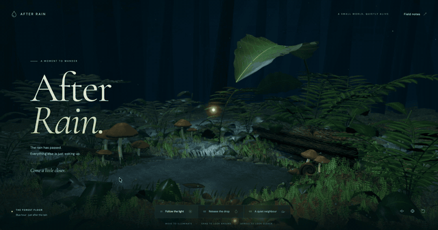

# After Rain

A small, interactive forest after the rain. A standalone Three.js scene with a wet canopy leaf, a refracting droplet, a shallow pool, procedural moss and ferns, a warm firefly, and a shy snail.

**[Explore the live scene ↗](https://hilimor.github.io/after-rain/)** — deployed from `main` by GitHub Actions.

[](https://hilimor.github.io/after-rain/)

An 8-second preview from the running scene. [Watch the full 19-second demo (MP4) ↗](https://hilimor.github.io/after-rain/demo/after-rain-demo.mp4) · [View the still image](public/demo/after-rain-cover.jpg).

**Canonical code root:** `/Users/hilimor/Documents/after-rain`, mirrored to `HiliMor/after-rain`. Independent of Skógafoss: it neither depends on nor changes that project.

## Run locally

Use Node.js 24 (developed with 24.18.0) and npm.

```sh
cd /Users/hilimor/Documents/after-rain
npm ci
npm run dev
```

Open **http://127.0.0.1:4187/**. Port 4187 is deliberately separate from 4173 and 5173. `strictPort` prevents Vite silently taking another project's port.

```sh
npm run build                 # TypeScript check + production build
npm run preview               # Serve dist on 4187; stop dev first
npm run preview -- --port 4188 # Serve production alongside dev
npm test                      # Browser interaction tests (installed Chrome)
```

To test the production server on 4188: `PREVIEW_URL=http://127.0.0.1:4188 npm test`.

The browser needs hardware accelerated WebGPU or WebGL 2. The default renderer prefers WebGPU and falls back to WebGL 2. Add `?webgl=1` to deliberately exercise the fallback. No remote services, accounts, API keys, generated-asset credits, or public deployment are involved. Fonts and all assets are served locally.

## Explore

| Action               | Mouse / keyboard                                         | Touch                                               |
| -------------------- | -------------------------------------------------------- | --------------------------------------------------- |
| Carry the warm light | Move over the scene; arrow keys also move it             | Tap to place the light                              |
| Wake the moss        | Move the light, or click the forest floor                | Tap the forest floor                                |
| Release the drop     | Click the large leaf or **Release the drop**             | Tap the leaf or **Release the drop**                |
| Find the snail       | **A quiet neighbour** brings the camera closer           | Same button; approaching its shell makes it retract |
| Look around          | Drag; Shift with the arrow keys does the same            | Drag with one finger                                |
| Move the framing     | Shift + drag, right/middle drag, or Alt + arrows         | Slide two fingers                                   |
| Look closer          | Scroll up to approach, down to step back; `+` / `-` keys | Pinch outward / inward                              |
| Change angle         | Compass button cycles three camera views                 | Same button                                         |
| Touch the lake       | Click the pool to send rings through the water           | Tap the pool                                        |
| Return home          | **Reset view** or Escape                                 | **Reset view**                                      |
| Sound                | Optional sound button, initially off                     | Same                                                |
| Instructions         | **Field notes**, Escape to close                         | **Field notes**, close button                       |

Water gathers in the cupped underside of the hero leaf. The leaf sways, the concealed bead pulls free and crawls slowly toward the tip before falling, creating ripples and splash beads. Clicking or tapping the pool sends a second set of travelling rings through the water and nudges the floating leaf. The land snail crawls slowly along the damp bank, pauses to explore with four independently bending tentacles, and withdraws when the pointer/light approaches. Its tentacles respond first; the head follows and waits briefly before emerging again. The close-up tracks the snail without changing its position, offers a gentle carried-light fill when the light is enabled, and keeps tall reeds out of the sightline. Narrow portrait stands further back so the head and tentacles stay in frame. The close-up stays open while you orbit, pan or zoom; leave it with the compass or Reset view.

All views share the same navigation controls. Zoom follows the current viewing direction, and pan scales with distance so close-up adjustments stay fine. Preset buttons restore their own framing. Direct movement has a short, single smoothing stage; passive pointer parallax stops changing once you frame a view yourself. Orbit and pan remain bounded to the built clearing, with a minimum viewing distance and terrain clearance; this is a diorama camera, not unrestricted first-person walking.

## Implementation

- Vite 8, TypeScript, Three.js r186 `WebGPURenderer` and TSL node materials.
- The hero leaf's relief is drawn from the same vein network as its colour map. The two used to be generated independently - painted beziers in one, straight ridges in the other - so no painted vein had any relief beneath it and the whole network read as lines drawn on paper.
- Beads resting on the leaf carry their own water rather than the hero drop's, whose thickness is an order above a bead's diameter and made them attenuate as though light crossed a far larger body, coming out milky. Their sizes follow a heavy-tailed spread, many small and a few large, weighted toward the cup and the midrib where rain actually gathers.
- Startup cost per phase is reported through `window.__afterRain.state().timings`, so a slow first load on real hardware can be attributed rather than guessed at. On this machine under six-times CPU throttling, compiling the scene's materials inside the first frame dominates it.
- Seeded procedural geometry, separate linear height/roughness maps, and local CC0 photographic PBR scans for bark and forest litter. Leaf veins, skin cells, shell growth striations, and mushroom fibers are authored procedurally. No stock models or AI-generated image backgrounds.
- The moss carpet carries no clearcoat: a sharp film on instanced blades that small sparkles into aliasing, and a soft one is invisible at their scale. Dew beads carry the wet read at ground level instead. (An earlier note here blamed frame rate for this; that measurement was wrong - see QA.md.)
- Dew beads are scattered across the carpet on their own material rather than the drop's, which is fully transmissive and would put a thousand instances through the transmission pass for beads a few pixels across. They are dark bodies with a hard clearcoat glint, since a pale body at this size reads as polystyrene.
- Instanced vegetation: 28,000 curved blades and 1,440 fine-leaved moss shoots on desktop, or 17,000 blades and 840 shoots on compact screens. A shared density field creates connected cushions and bare patches. Three shoot and fern shapes vary height, lean and missing leaflets; merged fallen leaves and twigs sit on the terrain between them.
- Mushrooms are aged rather than scaled from one copy: each draws its own cap profile, from young domed caps to broad ones with a lifted margin, with an independently leaning stem, a crown tilted off true, and per-cap pigment that darkens over the centre.
- Background trunks vary in value per instance, darken toward the base and spread over a deeper band so the fog separates them into layers; the backdrop is a shallow vertical gradient with the fog matched to the band the trunks stand in.
- A second broad-leaf understory layer and a softer ring of water-edge reeds add species variation around the clearing; leaf materials carry local wind deformation and nearby-light response.
- Foliage is translucent: light reaching the far side of a blade carries through to the camera, from the carried warm light and, more faintly, from the moon behind the clearing, so leaves read as lit rather than as opaque cutouts. A cheap directional approximation, not a subsurface solver.
- Wet surfaces are a rough leaf under a thin water film, so the gloss sits in a clearcoat rather than in the substrate. The film itself is patchy, not merely its roughness: water beads and runs off unevenly, and an even film over a whole blade is what reads as vinyl. The moss carpet carries no film at all, which is a performance decision as much as a visual one - see below.
- Understory leaves each age their own way, in colour, curl, size and hanging angle, with margins paling ahead of the middle of the blade.
- Ground mist lies in the hollow as stacked horizontal slices, weighted into the band behind the pool rather than over it, drifting and brightening where the carried light reaches it. Not a volumetric pass: the scene is read from above the clearing, so slices hold together, and the cost is fill rate alone.
- Physical transmission with water's IOR (1.333), reflective wet surfaces, environment lighting, TSL moss light propagation, layered water normals, and restrained bloom. A pale frond behind the drop makes its refraction visible.
- The pool has a deeper central bowl, submerged pebble geometry and a damp shoreline. Depth-dependent transparency reveals the actual ground underneath, with a dark water tint and stronger reflections at grazing angles. This is an inexpensive surface approximation; the pool does not run a separate physical refraction pass. The hero droplet and its beads retain physical transmission.
- Ripples perturb surface normals and reflection coordinates, not the water mesh's vertices. Their wavefronts use a direction-dependent warp and fine chop, with no ring meshes laid over the surface.
- A touch and a falling drop are not the same event and no longer make the same wave. The touch carries about half the amplitude on a tighter, slower packet with a finer wavelength, and rises over the first moment rather than arriving at full strength on the frame it lands.
- A passing wave breaks up the reflection and moves the moon sheen across the surface. The bed remains geometry seen through alpha blending; it is not optically refracted by these waves.
- The pool shades by actual depth: the sheet reconstructs the basin floor from the same profile the terrain mesh uses, carries a silty bank tone where it runs thin and a darker body where it deepens, and fades out as it thins so the shoreline is drawn by the ground contour rather than by the edge of a disc. Reflection is weighted by a grazing-angle term instead of mixed in at constant strength. A compass control cycles the wide clearing, waterline and leaf-study camera angles.
- The high tier uses depth of field and a 65%-resolution planar reflection; balanced removes depth of field and reduces the reflection to 40%; light uses environment reflections only. The mirror camera excludes transmissive droplets, avoiding nested transmission-buffer resizing in r186 at different render-target sizes. The primary camera and picking raycaster include them.
- Rendering profiles respond to viewport changes, including touch devices rotated into landscape. Drawing buffers have a pixel budget as well as a DPR cap. After warm-up, sustained frames below 48 fps reduce the tier; monitoring continues throughout the visit, while pauses and isolated stalls are ignored. The lower ceiling stays in place to prevent oscillation. Diagnostic `renderProfile` reports the active effects and pixel ratio. These are quality controls, not a guaranteed frame rate on every device.
- Lighting uses a restrained hemisphere/front fill, a cool moon rim and a soft canopy opening aimed at the hero leaf. Ground mist is thinner and almost absent over the pool, keeping its bed and bank readable.
- Materials use patchy roughness and restrained specular response, with the strongest highlights reserved for water. Directional PCF shadows anchor objects; they are cached and refreshed periodically or during a drop. The reflective pool does not cast into its own shadow pass.
- The snail is damp rather than glazed: shell and skin carry a weak water film with a deliberately broad highlight. Set strong and tight it threw hard white streaks and read as lacquered ceramic, which is worse than the fully matte surfaces it replaced.
- The snail's terrain-conforming sole carries small travelling contractions while it crawls, with a quieter shell and a short pause/observe rhythm. The motion is time-based rather than a fixed advance per frame. Four tapered tentacles deform as continuous meshes, with smaller eyes on the upper pair. Retraction, cautious waiting and gradual extension have separate timings; reduced motion freezes passive exploration while keeping the explicit approach response.
- Close-up materials use finer, lower-contrast skin relief, patchy damp highlights, growth marks and weathering on the shell, and a thin aperture lip. The sole and soft contact shade follow the actual bank; mushroom stems and wood chips sit into the ground, with local contact shading beneath the stems. Moss and dew sit lower at their roots, and taller reeds/seed stalks are shortened along the snail's camera sightline.
- The drop gathers at the tip before it falls: it rolls over the point, draws out into a pendant and hangs there, and the fall begins on exactly the shape the hang ended with. Without that step the bead switched from sliding to falling in a single frame between two states that did not agree - its height tripled and its width halved on that frame - and the blade, bent under the gathering weight, snapped straight at the same instant. It now springs back and rings instead.
- The hero drop stays hidden while idle; on interaction water gathers and runs down the blade as a flattened dome wetting the surface, drawn out along its direction of travel and lying along the slope it is on rather than tumbling, with a narrower neck and satellite beads trailing it. It becomes the pendant shape only where it hangs at the tip. Once airborne it is a sphere holding the same volume the running bead did, carrying the size it had on the leaf rather than changing scale at the moment it lets go; it leaves still drawn out by the neck it broke from, then rings between stretched and flattened as surface tension settles it, and falls to where its underside meets the water. The wet mark it leaves is a flat ribbon laid on the blade, each edge sampling the leaf surface at its own offset so it follows the cup. Resting beads are placed from the same surface formula the leaf is built from and wet down into shallow lenses.
- Reduced-motion preference disables passive wind, camera parallax, drifting particles, firefly flight, snail travel and tentacle exploration. Explicitly requested water interactions and the snail's response remain available. Scene time pauses while the tab is hidden.
- The firefly is a body, a glowing abdomen and a halo, with two small translucent wings beating against each other. A single rigid plate four times the body's length used to run through it on a glossy material, catching a specular and reading as a white rod. Its light pulses on a shaped curve rather than shining steadily, dim for most of the cycle and swelling briefly.
- Optional ambient sound is synthesized with Web Audio. It is off until a user gesture, and suspends with the hidden tab.
- Wheel deltas are normalised across `deltaMode`, so one notch means the same on a pixel-reporting browser and a line-reporting one; a single event is capped only against absurd spikes. `+` / `-` give looking closer a keyboard path.
- Dragging swings the view around what the camera is looking at, so the subject stays centred and only the angle on to it changes. Dragging was free input: on a mouse the light already follows the bare pointer, so a held button can mean something else, and a held button keeps the light still. Touch keeps one finger for the light and uses two travelling fingers, alongside the pinch that was already there. Pitch is clamped short of overhead and never drops the camera to the waterline.
- Pointer parallax swings the desktop camera around the clearing far enough to read, with the look target following a fraction of the swing so the composition stays anchored while the foreground travels against the distance. Touch viewports keep a fixed frame, since a drag there is already carrying the light.
- The camera follows its framing directly rather than smoothing an already-smoothed value at half rate, and the parallax offset settles on its own slower curve so a twitchy pointer cannot shake the frame. The push in to the snail stays deliberately slower than ordinary movement, and parallax is kept separate from the pointer used for picking so hit testing stays exact.
- The carried light has no drawn ring around it, only a glow that swells over anything activatable: an outline around a light in a forest reads as interface rather than as light.
- Controls have accessible names, focus indicators, keyboard equivalents, and a native modal dialog. Decorative numerals are hidden from assistive technology so each button is announced by its label alone.
- Interface blocks are checked for collisions across five window shapes in the browser tests, after the headline was found running into the footer on short windows. The decorative canvas is accompanied by a scene description. Renderer initialization failure displays a readable recovery panel.

### Source map

- `src/forest.ts` — scene construction, TSL materials, camera, interactions and animation.
- `src/nature.ts` — deterministic textures, organic geometry and terrain helpers.
- `src/surfaces.ts` — locally bundled scanned PBR maps and separate procedural surface-detail maps.
- `src/quality.ts` — sustained frame-budget monitoring and render profiles.
- `src/navigation.ts` — subject-relative orbit/dolly, distance-scaled pan and wheel normalization.
- `src/snail.ts`, `src/snail-motion.ts` — procedural snail rig, ground contact and time-based behaviour.
- `src/audio.ts` — opt-in synthesized ambience and drop sounds.
- `src/main.ts` — interface and application lifecycle.
- `src/style.css`, `index.html` — responsive interface and typography.
- `tests/forest.spec.ts` — browser tests of actual inputs and renderer states.
- `tests/quality.spec.ts` — deterministic coverage of sustained slow frames, pauses and drawing-buffer limits.
- `tests/navigation.spec.ts` — subject-relative zoom, pan scaling, reset and wheel modes. Browser tests also cover persistent close-ups, touch gestures and drag/click separation.
- `tests/snail-motion.spec.ts`, `tests/snail-geometry.spec.ts` — frame-rate independence, response order, reduced motion, bank contact and finite deforming geometry.

Read-only diagnostic state is available as `window.__afterRain.state()` for QA. It contains scene/rendering state only.

## Validation and remaining polish

The first version was visually inspected at 1512×982, 1280×800, and 390×844 in Chrome. Browser tests cover desktop interactions, direct leaf hits, snail approach/retreat, sound toggles, notes, zoom/reset, touch drag/pinch, viewport changes, forced WebGL 2, reduced motion, and the unsupported-renderer state. See `QA.md` for the recorded production run.

The scene remains an authored, stylized environment even after the material realism pass. It uses photographic bark/ground detail, varied mushroom caps, irregular leaf edges, fine curled moss, an expanding-whorl snail shell and cellular skin relief. The snail combines deforming meshes and an authored behavioural rhythm; it is not an anatomical muscle simulation. Its foot animation takes visual inspiration from [research on gastropod pedal waves](https://pmc.ncbi.nlm.nih.gov/articles/PMC6514465/), without claiming to reproduce their mechanics. The drop and waves are authored animations and shaders, not a fluid simulation. Directional shadows are cached at a limited update rate, supported by local soft contact patches; there is no full scene-wide contact-occlusion solution or volumetric scattering. Atmospheric shafts are soft translucent geometry. Actual iOS/Safari/Android hardware still needs verification. Audio controls were functionally checked; no studio listening/mixing pass is claimed.

The repository is public so the work can be read and the site can be published, but that is not a grant of rights: the source is all rights reserved, as `LICENSE` states, and `package.json` is marked `UNLICENSED`. Opening it up for reuse would be a deliberate change of licence, not an oversight to correct. See `CREDITS.md` for third-party licensing, which is unaffected.

Implementation references: [Three.js WebGPU guide](https://threejs.org/manual/pages/webgpurenderer.html), [node post-processing](https://threejs.org/manual/pages/webgpu-postprocessing.html), [TSL documentation](https://threejs.org/docs/pages/TSL.html).
